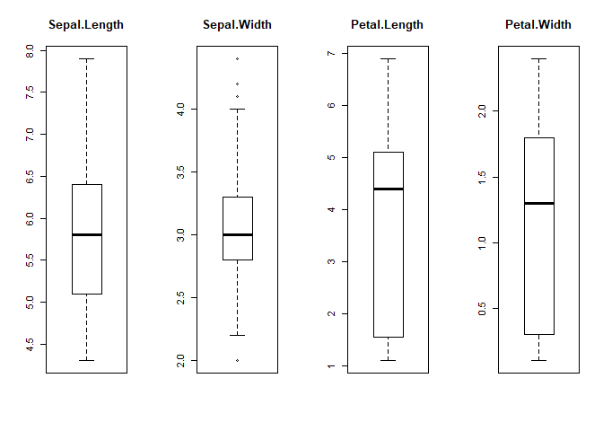
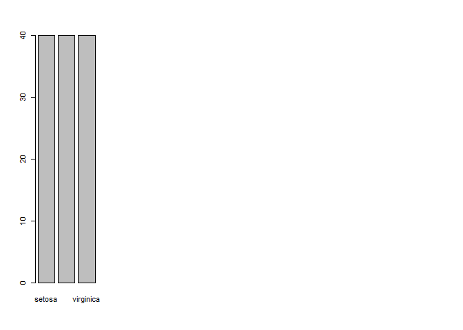
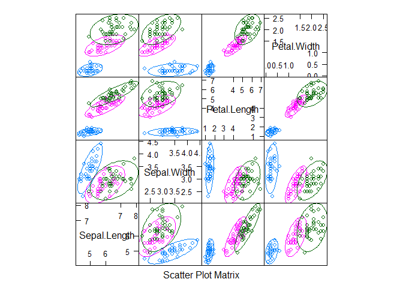
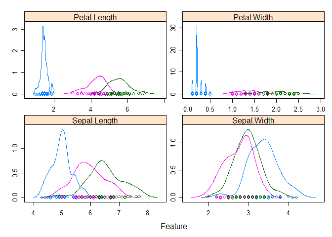
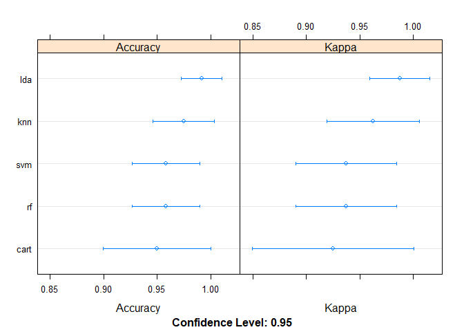

#Install Packages


```r
install.packages("caret", repos = "http://cran.us.r-project.org")
install.packages("lattice", repos = "http://cran.us.r-project.org")
install.packages("ggplot2", repos = "http://cran.us.r-project.org")
```
#Loading Dataset


```r
#optionally, could be loaded from a csv file. 
library('caret', 'lattice', 'ggplot2')
```

```
## Warning: package 'caret' was built under R version 3.4.3
```

```
## Warning in library("caret", "lattice", "ggplot2"): 'ggplot2' not found on
## search path, using pos = 2
```

```
## Loading required package: lattice
```

```
## Warning: package 'lattice' was built under R version 3.4.3
```

```
## Loading required package: ggplot2
```

```
## Warning: package 'ggplot2' was built under R version 3.4.3
```

```r
data(iris)
dataset <- iris
```

#Create a Validation Dataset

```r
#split 80/20
validation_index <- createDataPartition(dataset$Species,p=.8, list=FALSE)
#validation data
validation <-dataset[-validation_index,]
#training data
dataset <- dataset[validation_index,]
```

#Summarize Dataset

##Dimensions of Iris

```r
dim(dataset)
```

```
## [1] 120   5
```
##Attribute Types

```r
sapply(dataset, class)
```

```
## Sepal.Length  Sepal.Width Petal.Length  Petal.Width      Species 
##    "numeric"    "numeric"    "numeric"    "numeric"     "factor"
```

##Class Levels

```r
levels(dataset$Species)
```

```
## [1] "setosa"     "versicolor" "virginica"
```
##Class Distribution

```r
percentage <- prop.table(table(dataset$Species)) * 100
cbind(freq=table(dataset$Species), percentage=percentage)
```

```
##            freq percentage
## setosa       40   33.33333
## versicolor   40   33.33333
## virginica    40   33.33333
```
##Statistical Summary


```r
summary(dataset)
```

```
##   Sepal.Length    Sepal.Width     Petal.Length    Petal.Width   
##  Min.   :4.300   Min.   :2.200   Min.   :1.000   Min.   :0.100  
##  1st Qu.:5.100   1st Qu.:2.800   1st Qu.:1.600   1st Qu.:0.300  
##  Median :5.750   Median :3.000   Median :4.250   Median :1.300  
##  Mean   :5.826   Mean   :3.043   Mean   :3.738   Mean   :1.192  
##  3rd Qu.:6.400   3rd Qu.:3.300   3rd Qu.:5.100   3rd Qu.:1.800  
##  Max.   :7.900   Max.   :4.400   Max.   :6.900   Max.   :2.500  
##        Species  
##  setosa    :40  
##  versicolor:40  
##  virginica :40  
##                 
##                 
## 
```

#Visualize Dataset

##Univariate Plots

```r
# split input and output
x <- dataset[,1:4]
y <- dataset[, 5]

# create box and whisker plots of each input variable
par(mfrow=c(1,4))
  for(i in 1:4) {
    boxplot(x[,i], main=names(iris[i]))}
```

<!-- -->

```r
#class breakdown in bar plot -- equal amount of each
plot(y)
```

<!-- -->

##Multivariate Plots

```r
#create a scatterplot matrix
featurePlot(x=x, y=y, plot='ellipse')
```

<!-- -->

```r
#relationships between attributes and class values

#box and whisker plots for each attribute
featurePlot(x=x, y=y, plot='box')
```

<!-- -->

```r
#density plots per attribute by class value
scales <- list(x=list(relation="free"), y=list(relation="free"))
featurePlot(x=x, y=y, plot="density", scales=scales)
```

<!-- -->

#Evaluating Algorithms

##Test Harness

```r
#run algorithms on 10-fold cross validation
control <- trainControl(method="cv", number=10)
metric <- 'Accuracy'
```

##Building Models

```r
#Linear Discriminant Analysis
set.seed(7)
fit.lda <- train(Species~., data=dataset, method="lda", metric=metric, trControl=control)

#Classification and Regression Trees
set.seed(7)
fit.cart <- train(Species~., data=dataset, method="rpart", metric=metric, trControl=control)

#k Nearest Neighbors
set.seed(7)
fit.knn <-train(Species~., data=dataset, method="knn", metric=metric, trControl=control)

#Support Vector Machines
set.seed(7)
fit.svm <- train(Species~., data=dataset, method="rf", metric=metric, trControl=control)

#Random Forest
set.seed(7)
fit.rf <- train(Species~., data=dataset, method="rf", metric=metric, trControl=control)
```

##Which is the best?

```r
results <- resamples(list(lda=fit.lda, cart=fit.cart, knn=fit.knn, svm=fit.svm, rf=fit.rf))
summary(results)
```

```
## 
## Call:
## summary.resamples(object = results)
## 
## Models: lda, cart, knn, svm, rf 
## Number of resamples: 10 
## 
## Accuracy 
##           Min.   1st Qu.    Median      Mean 3rd Qu. Max. NA's
## lda  0.9166667 0.9375000 1.0000000 0.9750000       1    1    0
## cart 0.8333333 0.9166667 0.9166667 0.9333333       1    1    0
## knn  0.9166667 0.9166667 1.0000000 0.9666667       1    1    0
## svm  0.9166667 0.9166667 0.9583333 0.9583333       1    1    0
## rf   0.9166667 0.9166667 0.9583333 0.9583333       1    1    0
## 
## Kappa 
##       Min. 1st Qu. Median   Mean 3rd Qu. Max. NA's
## lda  0.875 0.90625 1.0000 0.9625       1    1    0
## cart 0.750 0.87500 0.8750 0.9000       1    1    0
## knn  0.875 0.87500 1.0000 0.9500       1    1    0
## svm  0.875 0.87500 0.9375 0.9375       1    1    0
## rf   0.875 0.87500 0.9375 0.9375       1    1    0
```

```r
dotplot(results)
```

<!-- -->

```r
#Best Model is LDA!
print(fit.lda)
```

```
## Linear Discriminant Analysis 
## 
## 120 samples
##   4 predictor
##   3 classes: 'setosa', 'versicolor', 'virginica' 
## 
## No pre-processing
## Resampling: Cross-Validated (10 fold) 
## Summary of sample sizes: 108, 108, 108, 108, 108, 108, ... 
## Resampling results:
## 
##   Accuracy  Kappa 
##   0.975     0.9625
```

#Make Predictions


```r
#run LDA on validation set
predictions <- predict(fit.lda, validation)
confusionMatrix(predictions, validation$Species)
```

```
## Confusion Matrix and Statistics
## 
##             Reference
## Prediction   setosa versicolor virginica
##   setosa         10          0         0
##   versicolor      0         10         0
##   virginica       0          0        10
## 
## Overall Statistics
##                                      
##                Accuracy : 1          
##                  95% CI : (0.8843, 1)
##     No Information Rate : 0.3333     
##     P-Value [Acc > NIR] : 4.857e-15  
##                                      
##                   Kappa : 1          
##  Mcnemar's Test P-Value : NA         
## 
## Statistics by Class:
## 
##                      Class: setosa Class: versicolor Class: virginica
## Sensitivity                 1.0000            1.0000           1.0000
## Specificity                 1.0000            1.0000           1.0000
## Pos Pred Value              1.0000            1.0000           1.0000
## Neg Pred Value              1.0000            1.0000           1.0000
## Prevalence                  0.3333            0.3333           0.3333
## Detection Rate              0.3333            0.3333           0.3333
## Detection Prevalence        0.3333            0.3333           0.3333
## Balanced Accuracy           1.0000            1.0000           1.0000
```
