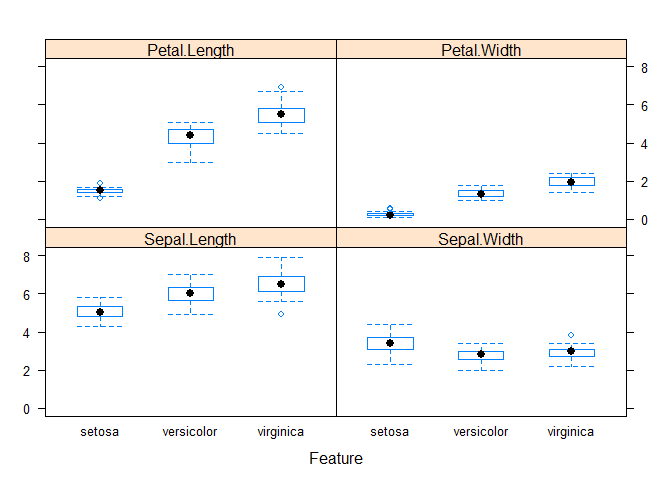

#Install Packages


```r
install.packages("caret", repos = "http://cran.us.r-project.org")
install.packages("lattice", repos = "http://cran.us.r-project.org")
install.packages("ggplot2", repos = "http://cran.us.r-project.org")
```
#Loading Dataset


```r
#optionally, could be loaded from a csv file. 
library('caret', 'lattice', 'ggplot2')
```

```
## Warning: package 'caret' was built under R version 3.4.3
```

```
## Warning in library("caret", "lattice", "ggplot2"): 'ggplot2' not found on
## search path, using pos = 2
```

```
## Loading required package: lattice
```

```
## Warning: package 'lattice' was built under R version 3.4.3
```

```
## Loading required package: ggplot2
```

```
## Warning: package 'ggplot2' was built under R version 3.4.3
```

```r
data(iris)
dataset <- iris
```

#Create a Validation Dataset

```r
#split 80/20
validation_index <- createDataPartition(dataset$Species,p=.8, list=FALSE)
#validation data
validation <-dataset[-validation_index,]
#training data
dataset <- dataset[validation_index,]
```

##Summarize Dataset

#Dimensions of Iris

```r
dim(dataset)
```

```
## [1] 120   5
```
#Attribute Types

```r
sapply(dataset, class)
```

```
## Sepal.Length  Sepal.Width Petal.Length  Petal.Width      Species 
##    "numeric"    "numeric"    "numeric"    "numeric"     "factor"
```

#Class Levels

```r
levels(dataset$Species)
```

```
## [1] "setosa"     "versicolor" "virginica"
```
#Class Distribution

```r
percentage <- prop.table(table(dataset$Species)) * 100
cbind(freq=table(dataset$Species), percentage=percentage)
```

```
##            freq percentage
## setosa       40   33.33333
## versicolor   40   33.33333
## virginica    40   33.33333
```
#Statistical Summary


```r
summary(dataset)
```

```
##   Sepal.Length    Sepal.Width     Petal.Length    Petal.Width   
##  Min.   :4.300   Min.   :2.000   Min.   :1.000   Min.   :0.100  
##  1st Qu.:5.100   1st Qu.:2.800   1st Qu.:1.600   1st Qu.:0.300  
##  Median :5.750   Median :3.000   Median :4.350   Median :1.300  
##  Mean   :5.821   Mean   :3.065   Mean   :3.742   Mean   :1.186  
##  3rd Qu.:6.300   3rd Qu.:3.400   3rd Qu.:5.100   3rd Qu.:1.800  
##  Max.   :7.900   Max.   :4.400   Max.   :6.900   Max.   :2.500  
##        Species  
##  setosa    :40  
##  versicolor:40  
##  virginica :40  
##                 
##                 
## 
```

##Visualize Dataset

#Univariate Plots

```r
# split input and output
x <- dataset[,1:4]
y <- dataset[, 5]

# create box and whisker plots of each input variable
par(mfrow=c(1,4))
  for(i in 1:4) {
    boxplot(x[,i], main=names(iris[i]))}
```

<!-- -->

```r
#class breakdown in bar plot -- equal amount of each
plot(y)
```

<!-- -->

#Multivariate Plots

```r
#create a scatterplot matrix
featurePlot(x=x, y=y, plot='ellipse')
```

<!-- -->

```r
#relationships between attributes and class values

#box and whisker plots for each attribute
featurePlot(x=x, y=y, plot='box')
```

<!-- -->


